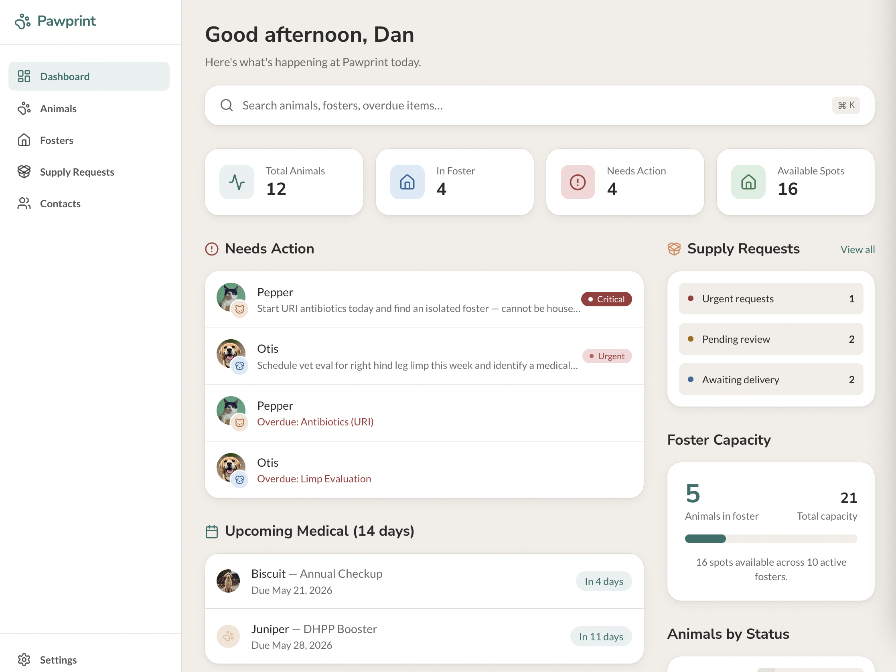
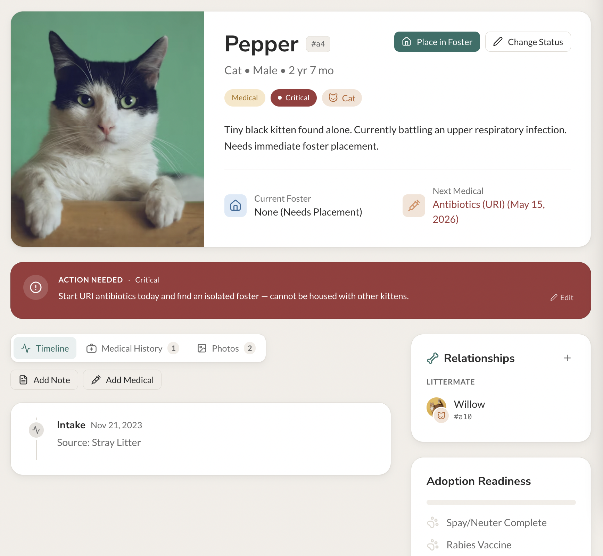
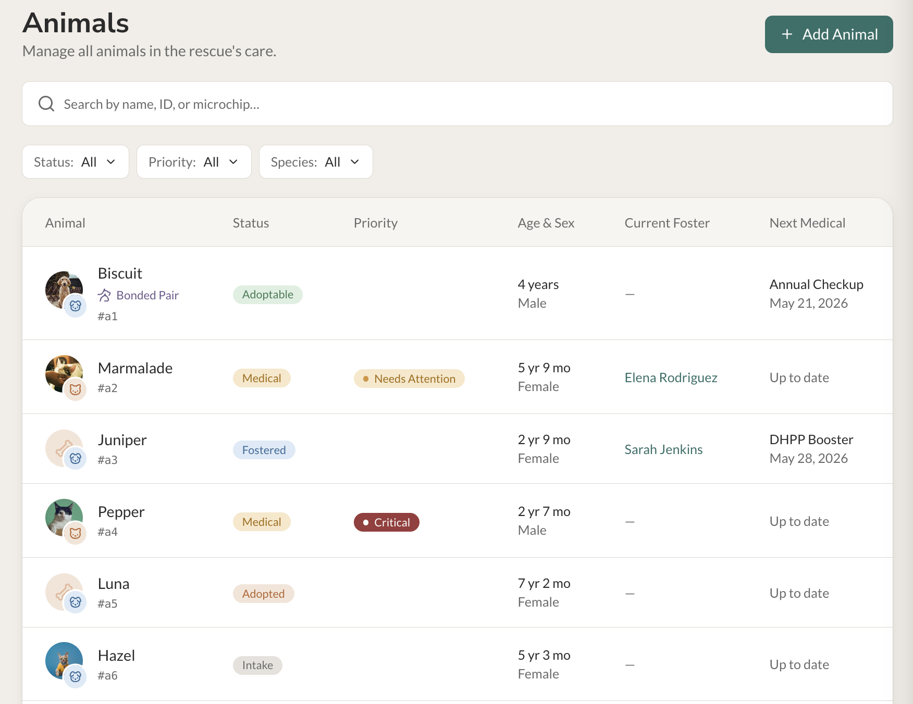
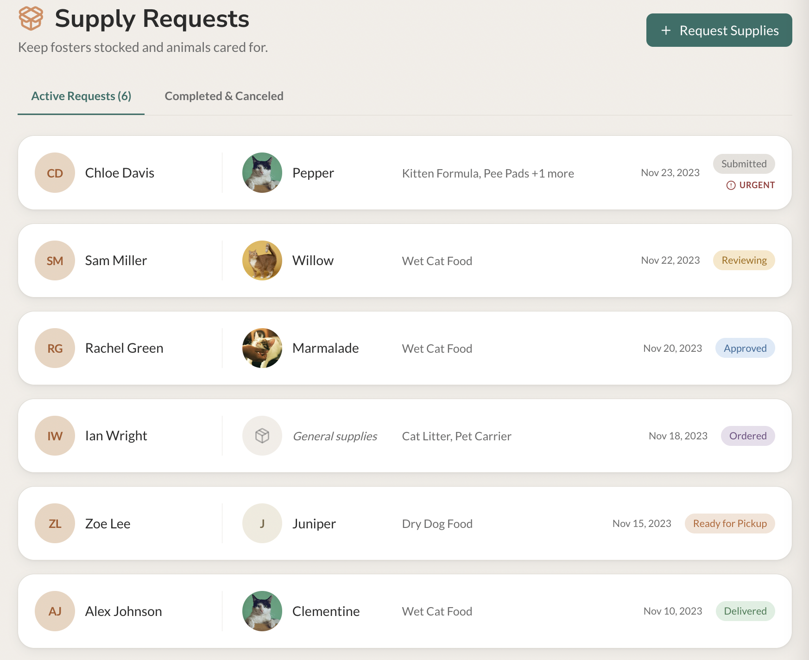
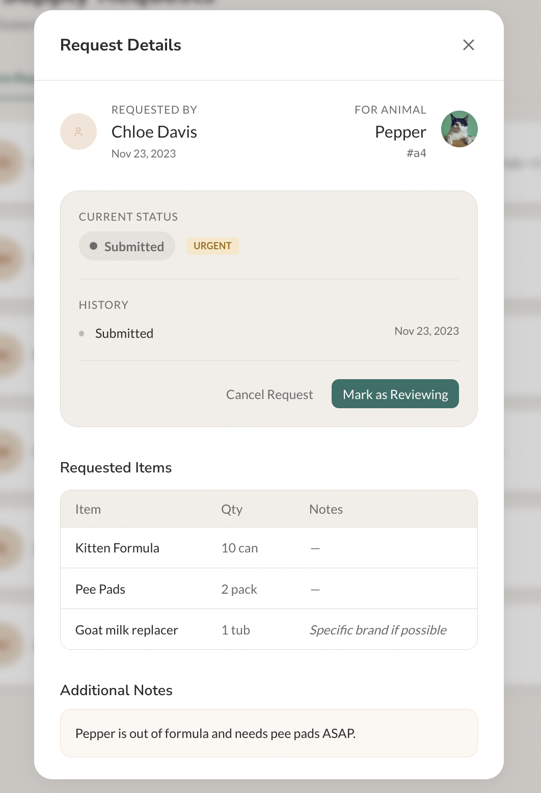
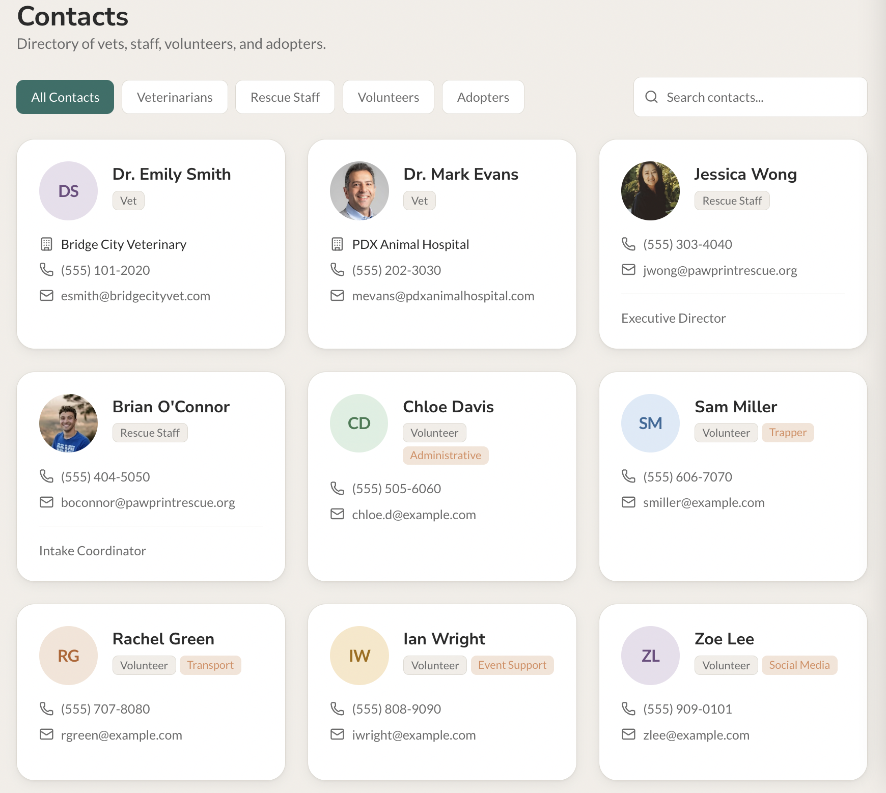

# Pawprint

An operationally-focused animal rescue management app. Pawprint helps small-to-medium rescues track animals, foster parents, medical care, supply logistics, and adoption pipelines without the bloat of legacy shelter software.

This document is the canonical reference for **product logic, data model, and design conventions**. Update it whenever a meaningful behavior changes.




---

## 1. Domain model

### Animal

The central record. Every animal has both a **lifecycle status** and an orthogonal **priority** — these answer two different questions.

| Field | Type | Notes |
|---|---|---|
| `id` | string | Stable identifier (e.g. `a4`). Surfaced in UI as `#a4`. |
| `name` | string | |
| `species` | `Dog \| Cat \| Other` | |
| `sex` | `Male \| Female \| Unknown` | |
| `estimated_birth_date` | ISO date | Drives `calculateAge()` display. |
| `intake_date` | ISO date | |
| `intake_source` | string | e.g. "City Shelter Transfer". |
| `status` | `AnimalStatus` | Lifecycle stage — see §2. |
| `priority` | `Priority` | Severity / attention level — see §3. |
| `action_needed` | string? | Short next-step sentence. Meaningful when `priority !== 'normal'`. See §4. |
| `description` | string | Free-form personality / context. |
| `microchip_number` | string? | |
| `primary_photo_url` | string? | |
| `adoption_profile_url` | string? | External Petfinder / Adopt-a-Pet / org listing URL. See §8. |



### Other entities

- **`FosterParent`** — has `max_capacity`, `preferred_species`, an `active` flag, and is paired to animals via `AnimalPlacement`.
- **`AnimalPlacement`** — links one animal to one foster with a `start_date`, optional `end_date`, and `placement_status` (`active` / `completed` / `interrupted`). An animal is considered "in foster" if any placement with `placement_status: 'active'` exists.
- **`MedicalRecord`** — procedure log with `procedure_type`, `procedure_name`, `status` (`completed` / `due` / `scheduled` / `overdue` / `canceled`), `performed_date` and/or `due_date`, `provider_name`, `notes`.
- **`AnimalNote`** — timestamped free-text note with a `note_type` (`behavior` / `medical` / `foster_update` / `adoption` / `general`).
- **`AnimalRelationship`** — animal-to-animal link (mother, father, sibling, etc.). See §8.
- **`AnimalPhoto`** — gallery photo with a `category`. See §8.
- **`Person`** — non-foster contacts: vets, rescue staff, volunteers, adopters. Used by the Contacts page and as the requester on supply requests.
- **`Product`**, **`SupplyRequest`**, **`SupplyRequestItem`** — supply ordering. See §10.

---

## 2. Status taxonomy (lifecycle)

Status describes **where the animal is in its journey**. It is intentionally a closed enum; arbitrary statuses are not supported.

| Value | Label | Meaning |
|---|---|---|
| `intake` | Intake | Just arrived. Awaiting evaluation or placement. |
| `medical` | Medical | Actively undergoing medical treatment or recovery. |
| `hold` | Hold | Administrative hold (court case, bite quarantine, owner dispute, etc.). |
| `fostered` | Fostered | In an active foster placement. |
| `adoptable` | Adoptable | Cleared for adoption and listed. |
| `adopted` | Adopted | Final outcome — adopted out. |
| `hospice` | Hospice | End-of-life comfort care. |
| `deceased` | Deceased | Final outcome — passed away. |

Status colors are tuned to feel calm and descriptive, not alarming. See `tailwind.config.js → colors.status`.

---

## 3. Priority taxonomy (severity)

Priority is **independent of status** and describes how much attention the animal needs right now. Normal priority is the default and is intentionally invisible in the UI so the app stays calm — only elevated priorities surface a pill.

| Value | Label | Visual treatment |
|---|---|---|
| `normal` | Normal | No badge displayed (default). |
| `needs_attention` | Needs Attention | Soft amber dot + pill. |
| `urgent` | Urgent | Warm red dot + pill. |
| `critical` | Critical | Solid deep red pill (highest visual weight). |

Priority ordering for sorts: `critical > urgent > needs_attention > normal`. See `PRIORITY_RANK` in `pages/Dashboard.tsx`.

---

## 4. Action Needed

Priority answers "how worried should I be?" Status answers "where is this animal?" **Action Needed** answers "what should someone do today?"

- `action_needed: string?` lives on `Animal`.
- It is **only meaningful when `priority !== 'normal'`**.
- The `ActionNeededCallout` component (rendered on the Animal Profile, below the hero) is the canonical surface for this field. It is hidden when priority is normal.
- Text should be specific and operational. Good: *"Soft food only + finish 10-day antibiotic course (3 days remaining). Recheck on Nov 25."* Bad: *"Needs care."*
- When priority is elevated but no action is set, the callout prompts: *"No action specified yet — what's the next step?"* with an Add button. This is a soft forcing function for data quality.
- The same string is reused as the subtitle in the Dashboard's **Needs Action** list and the Global Search's **Needs Attention** section. If `action_needed` is unset, those views fall back to `"Needs placement"` (no active placement) or `"Needs review"` (otherwise).

---

## 5. Greeting logic

`getGreeting(date = new Date())` in `lib/utils.ts` returns one of four prefixes based on the user's local time. Boundaries are minute-precise and inclusive.

| Window | Greeting |
|---|---|
| 5:01 am – 11:00 am | Good morning |
| 12:01 pm – 5:00 pm | Good afternoon |
| 7:01 pm – 1:00 am (crosses midnight) | Good evening |
| All other minutes (1:01–5:00, 11:01–12:00, 5:01–7:00) | Welcome back |

The user name is currently hardcoded as `CURRENT_USER_NAME = 'Dan'` in `pages/Dashboard.tsx` with a `TODO` to wire to `useUser().name` when auth lands.

---

## 6. Global search

`components/search/GlobalSearch.tsx` is the primary discovery surface, rendered prominently on the Dashboard.

**What it searches:**
- **Animals** — name, id, microchip number
- **Fosters** — first name, last name, email
- **Contacts** — first name, last name, email, organization

**Empty-query behavior:** When focused with no query, the panel shows a **Needs Attention** default section containing all overdue medical records and all `urgent`/`critical` animals. This makes the search bar useful as an at-a-glance triage tool, not just a search.

**Keyboard:**
- `Cmd/Ctrl + K` — focus the search and open the panel.
- `Esc` — close the panel and blur the input.
- Click any result to navigate to its detail page.

Results are capped per section (5 animals, 5 fosters, 4 contacts, 5 needs-attention items) to keep the panel scannable.

---

## 7. Filters (Animals list)

Hierarchy is intentional:
1. **Search** is dominant — full-width, 48px tall, with a clear (×) button when populated.
2. **Filter pills** sit below in a single compact row: `Status`, `Priority`, `Species`. Each is a `FilterDropdown` (custom popover) showing "Label: value ▾".
3. **Active filter chips** appear below the pills when any filter is applied. Each chip can be cleared individually; a "Clear all" link resets everything. A live "n of m animals" counter sits on the right.

**The Foster filter was intentionally removed** — at scale (dozens of fosters), a dropdown becomes a wall. Search by foster name or use the Fosters page instead.

**Species filter auto-hides** when `ENABLED_SPECIES` contains only one species (see §11).

**Bonded pair indicator.** When an animal has a `bonded_pair` relationship, a small lavender-gray "Bonded Pair" chip with a two-pets glyph renders under its name in the table. Coordinators can spot inseparable pairs without opening the profile.



---

## 8. Relationships, photos, and the adoption listing

The Animal Profile carries three additional surfaces that round out the record.

### Relationships
Animals can be linked via `AnimalRelationship` records with type `mother | father | child | sibling | littermate | bonded_pair`.

- **Storage is one-directional.** A record like `{ animal_id: 'a2', related_animal_id: 'a10', relationship_type: 'mother' }` means "a2 is the mother of a10."
- **Display is bidirectional.** The `RelationshipsCard` walks the relationships list and derives the inverse automatically, so a10's page shows "Mother: a2" without needing a duplicate row.
- Symmetric types (`sibling`, `littermate`, `bonded_pair`) appear identically on both ends.
- **The card always renders.** When empty, it shows a soft empty state with a "Link to another animal" CTA. The "Add" button in the header opens `AddRelationshipModal`, which has a searchable animal picker that excludes the current animal and any already-linked animals.
- "Bonded With" is highlighted with a heart icon — adoption coordinators need to see at a glance that an animal cannot be separated.
- The card header uses the custom `BoneIcon` since the relationships are animal-to-animal, not people.

### Photo gallery
Animals can carry many photos (`AnimalPhoto` records) categorized by `PhotoCategory`: `intake | profile | medical | foster | adoption | post_adoption | other`. The Animal Profile has a dedicated **Photos** tab that:

- Groups photos by category in display order (profile → intake → medical → foster → adoption → post_adoption → other).
- Renders a square thumbnail grid with hover-overlay captions.
- Opens a full-screen lightbox on click with keyboard navigation (← / → / Esc) and a delete affordance.
- Has its own "Add Photo" modal that accepts either a URL **or** a file upload (converted to a data URL via `FileReader.readAsDataURL` since we have no upload backend yet).
- Accepts drag-and-drop directly onto the gallery: drop an image anywhere on the tab and the modal opens pre-filled with that image.

`primary_photo_url` on `Animal` remains the single "featured" photo used in lists and the profile hero — intentionally separate from the gallery.

### Adoption listing
When an animal's `status` is `adoptable`, the `AdoptionProfileCard` appears in the right sidebar with the external `adoption_profile_url` (Petfinder, Adopt-a-Pet, or the org's own site) plus Open / Copy / Edit actions. If status is adoptable but no URL is set, the card prompts to add one — same forcing-function pattern as Action Needed. The card is hidden entirely for non-adoptable statuses.

---

## 9. Medical history

The Animal Profile uses a tabbed left column:

- **Timeline** — all events (intake, medical, placements, notes) in reverse chronological order.
- **Medical History** — medical records only, grouped into Overdue / Upcoming / Completed / Other, each in a separate card with a colored header. Each record shows procedure name, type, status pill, date (with prefix: "Performed" / "Was due" / "Due"), provider, and notes.
- **Photos** — see §8.

This separation lets a user verify medical compliance without sifting through unrelated events. The Medical History tab uses the custom `MedicalKitIcon` (a briefcase + plus glyph) instead of a generic clipboard.

---

## 10. Supply Requests

The Supplies feature lives at `/supplies` and is designed to feel like **coordinating care resources**, not filing procurement tickets. Lead with the person and the animal; the request ID is a detail, not a header.

### Domain

Three tables back the feature:

- **`Product`** — lightweight catalog (`id`, `name`, `category`, `default_unit`, `active`). Categories: `food | litter | medical | bedding | enrichment | cleaning | other`.
- **`SupplyRequest`** — the parent record (`requester_person_id`, optional `requested_for_animal_id`, `status`, `priority`, `requested_date`, optional `needed_by_date`, optional `approved_by_person_id` / `fulfilled_by_person_id` / `fulfilled_date`, optional `delivery_method` (`pickup | drop_off | shipped`), `notes`, timestamps).
- **`SupplyRequestItem`** — line items, each pointing to either a `product_id` from the catalog **or** a `custom_item_name` (for items not in the catalog), plus `quantity`, `unit`, and optional `notes`.

A request can have many items. Each item is for the same request — multi-animal requests are intentionally out of scope for now.



### Status lifecycle

| Value | Label | Meaning |
|---|---|---|
| `submitted` | Submitted | Just created by the requester. |
| `reviewing` | Reviewing | Staff is evaluating the request. |
| `approved` | Approved | Cleared to order. |
| `ordered` | Ordered | Placed with a vendor. |
| `ready_for_pickup` | Ready for Pickup | Available at the rescue. |
| `delivered` | Delivered | Handed off to the requester. |
| `completed` | Completed | Closed out. |
| `canceled` | Canceled | Soft exit at any point. |

`SupplyRequestPriority` is `normal | urgent | critical`, orthogonal to status (same pattern as animals — see §3).



### Surfaces

- **Supplies page (`/supplies`)** — tabbed list of Active vs. Completed/Canceled requests. Each row leads with the requester avatar (rendered in a consistent peach tone using the `Avatar` `tone="peach"` variant) and the animal avatar; the line-item summary, requested date, and status pill sit to the right. When no specific animal is set, a "General supplies" placeholder fills the animal slot so the row stays visually balanced.
- **Request detail modal** — opened by clicking any row. Shows requester + animal, a **current-status pill** with a colored dot, a **History** list derived from `created_at`, `approved_by_person_id`, `fulfilled_date`, `fulfilled_by_person_id`, and `updated_at`, the line items as a table, and quick-advance / cancel buttons. The presentation is deliberately soft — no horizontal lifecycle stepper, no progress bar. Status feels like a current moment + a short paper trail, not a corporate workflow.
- **New request modal** — requester + optional animal + priority + per-item cards. Each item card has a product dropdown (with an "Other" custom-item option), quantity + unit (unit is a dropdown of common units; auto-fills from the product's `default_unit` when a catalog product is selected), and optional notes. A dashed "+ Add another item" CTA appends a card. A "Save as common request" checkbox at the bottom is wired to form state for a future templates feature.
- **Dashboard widget** — three soft counts on the dashboard: Urgent requests, Pending review (submitted + reviewing), Awaiting delivery (approved + ordered + ready_for_pickup). Each row links to `/supplies`.

### UX north star

Wherever supply requests render, **the requester and animal are the subject of the sentence**, not metadata. Labels like "Requested by" and "For animal" are dropped in lists once the avatars convey the meaning. The vertical divider between requester and animal blocks uses `border-border/60` to feel like a soft separator rather than a column break.

---

## 11. Org-level configuration

`lib/config.ts` is the seed of a future settings layer. Today it exports:

- **`ENABLED_SPECIES: Species[]`** — controls which species the app surfaces in filters and (eventually) creation forms. A dog-only rescue should set this to `['Dog']`; the species filter then disappears from the Animals page entirely.

When auth/settings persistence land, these constants should move to a per-organization settings record.

---

## 12. Design tokens

Defined in `tailwind.config.js`:

- **Background**: `#F1EEE8` (warm cream — slightly darker than card to give cards lift).
- **Card**: `#FFFFFF`.
- **Border**: `#DDD9D1`.
- **Primary**: `#2E6F68` (deep teal-green — the brand color).
- **Secondary**: `#D98C5F` (warm terracotta — used for the Supplies icon and accents).
- **Text**: `#2B2B2B` primary / `#6B6B6B` secondary.
- **Shadows**: `soft` (1px + 4px layered) and `soft-lg` (24px) — used on cards and popovers respectively.
- **Status palette**: each status has a `bg` and `text` pair tuned for soft readability. See `colors.status`.
- **Typography**: `Lato` for body, `Nunito Sans` for headings.

The visual goal is **calm + operational** — like a well-run vet clinic, not a SaaS dashboard.

### Custom icons

A handful of glyphs are hand-rolled to give the app a distinct, warmer feel than the default lucide set:

- **`MedicalKitIcon`** (`components/ui/MedicalKitIcon.tsx`) — a briefcase + plus glyph used for the Medical History tab and empty state.
- **`BoneIcon`** (`components/ui/BoneIcon.tsx`) — used in the Relationships card header, the Dashboard "All caught up!" empty state, and as the Avatar fallback for dogs without a photo.
- **`PawPrintIcon`** (`components/ui/PawPrintIcon.tsx`) — used as the Avatar fallback for cats / other species without a photo, the Animals list empty state, and the unchecked items in the Adoption Readiness checklist.

The Avatar primitive also supports a fixed `tone` prop (currently `'peach'`) for surfaces that want consistent initial-avatar styling — used on the Supplies list to give every requester the same warm peach + terracotta palette regardless of name.



---

## 13. File structure

```
/
├── App.tsx                          Router + WhiskerProvider
├── index.tsx, index.css             Entry
├── tailwind.config.js               Theme tokens
├── types/index.ts                   All TypeScript types
├── data/seed.ts                     Seed records for in-memory state
├── lib/
│   ├── utils.ts                     cn, calculateAge, formatDate, getDaysUntil, getGreeting
│   ├── config.ts                    ENABLED_SPECIES (org-level config)
│   └── colors.ts                    Avatar color hashing
├── context/WhiskerContext.tsx       Global state + CRUD actions
├── components/
│   ├── ui/                          Primitives: Button, Card, Modal, Forms, Badge,
│   │                                Avatar, FilterDropdown, SpeciesBadge, SpeciesFilter,
│   │                                MedicalKitIcon, BoneIcon, PawPrintIcon
│   ├── layout/                      AppShell, Sidebar
│   ├── animals/                     Animal modals, ActionNeededCallout, RelationshipsCard,
│   │                                AdoptionProfileCard, PhotoGallery, AddPhotoModal,
│   │                                AddRelationshipModal
│   ├── fosters/                     Foster-specific modals
│   ├── supplies/                    NewSupplyRequestModal, SupplyRequestDetailModal
│   └── search/GlobalSearch.tsx      Global search component
└── pages/                           Dashboard, AnimalsList, AnimalProfile,
                                     FostersList, FosterProfile, Contacts, SupplyRequests
```

---

## 14. Conventions

- **Components**: one per file, named exports only, PascalCase.
- **Types**: shared types live in `types/index.ts`. Local component prop types stay inline.
- **State**: all entity state lives in `WhiskerContext` and is mutated via context actions (`addAnimal`, `updateAnimal`, `placeAnimal`, `addNote`, `addRelationship`, `addPhoto`, `addSupplyRequest`, `updateSupplyRequest`, `addSupplyRequestItem`, etc.). Components never mutate data directly.
- **Status / Priority changes** flow through the `ChangeStatusModal` (which captures both fields together and can record a reason as a `general` note). Supply request status advances go through quick-action buttons on the detail modal.
- **Date inputs** use the shared `Input` component, which auto-normalizes Safari's native date picker rendering. Never apply per-instance date styling.
- **Avatars in lists** prefer photos when available, fall back to initials when a `name` is passed, and only fall back to icons when neither is available. Pass `species` for animal avatars so the dog/cat fallback glyph is correct.

---

## Naming

The app is **Pawprint** (lowercase second syllable). The earlier working name was **Whisker**, which is still referenced in the internal context (`WhiskerProvider`, `useWhisker`) — that's intentionally untouched since it doesn't surface in the UI.